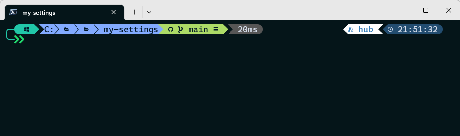
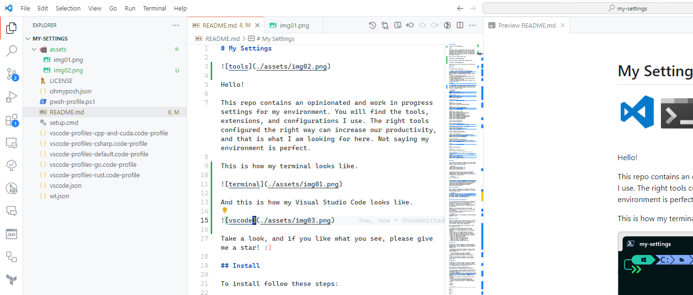

# My Environment


Hello!

This repo contains opinionated and work-in-progress settings for my environment. You will find the tools, extensions, and configurations I use. The right tools configured the right way can increase our productivity, and that is what I am looking for here. I am not saying my environment is perfect.

The image below shows what my terminal looks like.



And this is what my Visual Studio Code looks like. For the ones who love dark themes, I had my time using dark themes, and now I am back to light themes! Do not judge me!



Take a look, and if you like what you see, please give me a star! :)

## Install

To install, follow these steps:

1. Install a font from [Nerd Fonts](https://www.nerdfonts.com/font-downloads). I use [CaskaydiaCove Nerd Font](https://www.programmingfonts.org/#cascadia-code) on Windows Terminal and Visual Studio Code.
2. Clone the repo wherever you want.
3. Open an **elevated** Command Prompt and go to the directory where you cloned.
4. Execute **setup.cmd**. It will create some symlinks to point the tools to this repo.
5. Follow the remaining sections here to install and configure the tools.

## Windows Features

The Windows features below are the **only** ones I have enabled.

- Containers
- Hyper-V
- Microsoft Print to PDF
- Print and Document Services
- Remote Differential Compression API Support
- SMB Direct
- Telnet Client
- Virtual Machine Platform
- Windows Hypervisor Platform
- Windows Sandbox (take a look at the _downloads.wsb_ file for a sample sandbox)
- Windows Subsystem for Linux

## Winget

I use [winget](https://github.com/microsoft/winget-cli) to install most of my applications. Below, you can find the ones I use formatted as command line ready for use. They are  grouped by subject.

```powershell
# Kubernetes
winget install Helm.Helm
winget install Kubernetes.kubectl

# Git & GitHub
winget install Git.Git
winget install GitHub.GitLFS
winget install GitHub.cli

# Machine Learning
winget install LutzRoeder.Netron

# Gaming
winget install Valve.Steam
winget install EpicGames.EpicGamesLauncher

# Shell
winget install Microsoft.PowerShell
winget install JanDeDobbeleer.OhMyPosh
winget install Neovim.Neovim

# General
winget install RARLab.WinRAR
winget install Microsoft.VisualStudioCode
winget install AgileBits.1Password
winget install WhatsApp.WhatsApp
winget install HHDSoftware.FreeHexEditorNeo
winget install Adobe.Acrobat.Reader.64-bit
winget install OBSProject.OBSStudio
winget install Google.GoogleDrive
winget install Microsoft.PowerToys
winget install Audacity.Audacity
winget install SweetScape.010Editor
winget install GIMP.GIMP
winget install JGraph.Draw

# Best video player PERIOD
winget install VideoLAN.VLC

# Best bookmark manager ever!
winget install RustemMussabekov.Raindrop

# Windows Subsystem for Linux. 9PKR34TNCV07 is Kali Linux from Microsoft Store.
winget install Canonical.Ubuntu.2204
winget install 9PKR34TNCV07

# CLI to manage the best cloud! :)
winget install Microsoft.AzureCLI

# General Developer Tools
winget install DBBrowserForSQLite.DBBrowserForSQLite
winget install BurntSushi.ripgrep.MSVC
winget install Docker.DockerDesktop
winget install Microsoft.VisualStudio.2022.Community --override "--quiet --add Microsoft.VisualStudio.Workload.NativeDesktop --add Microsoft.VisualStudio.Workload.NativeCrossPlat"

# .NET development.
winget install Microsoft.DotNet.SDK.7
winget install icsharpcode.ILSpy

# Rust
winget install Rustlang.Rustup

# Go
winget install GoLang.Go

# Node.js
winget install OpenJS.NodeJS.LTS

# I love games, so I have a gamer PC and need to install these ones.
# 9NFKC78BRS8W  is Kingston FURY CTRL from Microsof Store.
winget install 9NFKC78BRS8W 
winget install Corsair.iCUE.4
winget install Elgato.StreamDeck
```

## Python

I am studying artificial intelligence, so I must master Python. I also use winget to install Python, and I keep the last three versions installed.

```powershell
winget install Python.Python.3.10
winget install Python.Python.3.11
winget install Python.Python.3.12
```

To manage the many versions installed, I use [Python Launcher](https://docs.python.org/3/using/windows.html#launcher). At the command line, I use the following to specify which Python to use.

```powershell
py -3.11 -m pip list
```

For my projects, I am using [pipenv](https://pipenv.pypa.io/en/latest/) to manage dependencies and environments. I also use the excellent Visual Studio Code extension [Python Environment Manager](https://marketplace.visualstudio.com/items?itemName=donjayamanne.python-environment-manager).

## Git Configuration

Below is my Git configuration. I configure my name and email, turn off any line-breaking handling, and consider all directories safe.

```powershell
git config --global user.name "George Luiz Bittencourt"
git config --global user.email "george@georgeluiz.com"
git config --global core.autocrlf false
git config --global --add safe.directory *
```

## 1Password and Git SSH Integration

I use [1Password](https://1password.com/) to manage my passwords and I 😍 this tool! I have been using it for the last four years, and it is worth every penny.
One feature I like is the SSH agent it has so that I can store my key pairs inside it, and SSH can use it transparently.

However, Git for Windows has its own SSH installed, and this version does not use the SSH agent from 1Password.
To fix that, I had to specify globally what SSH to use using the command line below.

```powershell
git config --global core.sshCommand C:/Windows/System32/OpenSSH/ssh.exe
```

## Windows Terminal

Microsoft invested a lot in Windows Terminal, and today, there is no better terminal! It is an [open-source project](https://github.com/microsoft/terminal), has many features, and is fully customizable.

My configuration file is [here](./wt.json). My customizations are:

- The number of columns (220) and rows (60) are customized for my screen resolution. I use a QHD resolution, so I have much more space.
- Add an entry in the command palette for **each** profile with the **_** prefix to find them easily.
- **F1** will open the command palette. I use the same shortcut for Visual Studio Code and Windows Terminal.
- **F2** will duplicate my terminal.
- **F3** will open the search box.
- **F4** will close the current terminal.
- **F9** will open a new PowerShell tab.
- **F10** will open a new Ubuntu tab.
- **F11** will open a new Kali Linux tab.

## Oh My Posh

Oh My Posh is the best companion for Windows Terminal and PowerShell. You can download it from [here](https://ohmyposh.dev/), and my configuration file is [here](./ohmyposh.json).

I customized it based on a template I liked and added several segments to provide context for my tools. The customizations are:

1. It will show my current Azure subscription.
2. My current Kubernetes context is shown.
3. Python version and environment will be shown as well.
4. The Git integration is fantastic. It will show my current branch, the difference between local and remote clones, etc.

## Environment Variables

These are the environment variables I have defined to customize my environment.

| Env Var                   | Content                                                       | Description                                                                    |
|:-------------------------:|---------------------------------------------------------------|--------------------------------------------------------------------------------|
|HF_DATASETS_CACHE          |datasets dir path                                            |Directory where the Hugging Face datasets lib will save the downloaded datasets.|

## Bash functions

I have developed the functions below to facilitate my work. I will add more functions as needed. You can find their source code [here](./bash-functions.sh).
Simply load this file from your [.bashrc](<https://www.gnu.org/software/bash/manual/html_node/Bash-Startup-Files.html>) file.

1. pinfo
2. cinfo

## PowerShell

PowerShell is my official shell (I am still thinking if I will adopt it in Linux instead of bash/zsh), and it is amazing to see how it evolved. With PowerShell Core it is possible to use it in Linux, too! :)

You can find my customized profile [here](./pwsh-profile.ps1). The customizations I created are:

- I use the famous [Terminal-Icons](https://github.com/devblackops/Terminal-Icons) module to include icons in my directory listing.
- The module [PSReadLine](https://github.com/PowerShell/PSReadLine) is configured to show in listview format my history as soon as I start typing a command from my history.
- **CTRL+B** will open the current directory in File Explorer.
- **CTRL+G** will jump to my projects directory.
- It will load [Oh My Posh](https://ohmyposh.dev/).
- I have the following _aliases_ for common commands/actions:

| Alias     | Command                                                       |
|:---------:|---------------------------------------------------------------|
|k          |kubectl                                                        |
|d          |docker                                                         |
|he         |helm                                                           |
|g          |git                                                            |
|t          |terraform                                                      |
|vi         |vim                                                            |
|l          |Get-ChildItem                                                  |
|ll         |Get-ChildItem                                                  |
|kctx       |[kubectx](https://github.com/ahmetb/kubectx)                   |
|kns        |[kubens](https://github.com/ahmetb/kubectx)                    |
|gcl        |git clone <url>                                                |
|gs         |git status                                                     |
|kaf        |k apply -f <file>                                              |
|kgp        |k get pods <namespace>                                         |
|kgd        |k get deployment -n <namespace> <deployment>                   |
|gcoph      |git add -A; git commit -m <message>; git push                  |
|kcreds     |az aks get-credentials <resourceGroup> <clusterName>           |

Before I can use my customized PowerShell, I must install the following modules:

```powershell
Install-Module -Name Terminal-Icons -Repository PSGallery
Install-Module -Name Az -Repository PSGallery -Force
```

## Visual Studio Code

Here, you will find the Visual Studio Code extensions I use and recommend.
I have split them between profiles to lower the number of extensions loaded. You can download my profiles here and load them into your Visual Studio Code.

- [C#](./vscode-profiles-csharp.code-profile)
- [C++ & CUDA](./vscode-profiles-cpp-and-cuda.code-profile)
- [Default](./vscode-profiles-default.code-profile)
- [Go](./vscode-profiles-go.code-profile)
- [Rust](./vscode-profiles-rust.code-profile)

I use [Settings Sync](https://code.visualstudio.com/docs/editor/settings-sync) to keep my settings synchronized between the computers I use and [GitHub Codespaces](https://github.com/features/codespaces). You can find my settings [here](/vscode.json).

The table below shows all my extensions I use organized by type and profile.

|Id                                                                                                                                                 |Name                                     |Type                     |Profile            |
|---------------------------------------------------------------------------------------------------------------------------------------------------|-----------------------------------------|-------------------------|-------------------|
|[42crunch.vscode-openapi](https://marketplace.visualstudio.com/items?itemName=42crunch.vscode-openapi)                                             |OpenAPI (Swagger) Editor                 |API                      |Default            |
|[adamhartford.vscode-base64](https://marketplace.visualstudio.com/items?itemName=adamhartford.vscode-base64)                                       |vscode-base64                            |Productivity             |Default            |
|[azapi-vscode.azapi](https://marketplace.visualstudio.com/items?itemName=azapi-vscode.azapi)                                                       |Terraform AzApi Provider                 |IaC                      |Default            |
|[bierner.github-markdown-preview](https://marketplace.visualstudio.com/items?itemName=bierner.github-markdown-preview)                             |GitHub Markdown Preview                  |Markdown                 |Default            |
|[charliermarsh.ruff](https://marketplace.visualstudio.com/items?itemName=charliermarsh.ruff)                                                       |Ruff                                     |Python                   |Default            |
|[codezombiech.gitignore](https://marketplace.visualstudio.com/items?itemName=codezombiech.gitignore)                                               |gitignore                                |Git                      |Default            |
|[DavidAnson.vscode-markdownlint](https://marketplace.visualstudio.com/items?itemName=DavidAnson.vscode-markdownlint)                               |markdownlint                             |Markdown                 |Default            |
|[donjayamanne.githistory](https://marketplace.visualstudio.com/items?itemName=donjayamanne.githistory)                                             |Git History                              |Git                      |Default            |
|[donjayamanne.python-extension-pack](https://marketplace.visualstudio.com/items?itemName=donjayamanne.python-extension-pack)                       |Python Extension Pack                    |Python                   |Default            |
|[eamodio.gitlens](https://marketplace.visualstudio.com/items?itemName=eamodio.gitlens)                                                             |GitLens — Git supercharged               |Git                      |Default            |
|[editorconfig.editorconfig](https://marketplace.visualstudio.com/items?itemName=editorconfig.editorconfig)                                         |EditorConfig for VS Code                 |Productivity             |Default            |
|[esbenp.prettier-vscode](https://marketplace.visualstudio.com/items?itemName=esbenp.prettier-vscode)                                               |Prettier - Code formatter                |Productivity             |Default            |
|[GitHub.codespaces](https://marketplace.visualstudio.com/items?itemName=GitHub.codespaces)                                                         |GitHub Codespaces                        |GitHub                   |Default            |
|[GitHub.copilot](https://marketplace.visualstudio.com/items?itemName=GitHub.copilot)                                                               |GitHub Copilot                           |GitHub                   |Default            |
|[github.github-vscode-theme](https://marketplace.visualstudio.com/items?itemName=github.github-vscode-theme)                                       |GitHub Theme                             |Themes                   |Default            |
|[github.remotehub](https://marketplace.visualstudio.com/items?itemName=github.remotehub)                                                           |GitHub Repositories                      |GitHub                   |Default            |
|[github.vscode-github-actions](https://marketplace.visualstudio.com/items?itemName=github.vscode-github-actions)                                   |GitHub Actions                           |GitHub                   |Default            |
|[github.vscode-pull-request-github](https://marketplace.visualstudio.com/items?itemName=github.vscode-pull-request-github)                         |GitHub Pull Requests and Issues          |GitHub                   |Default            |
|[GrapeCity.gc-excelviewer](https://marketplace.visualstudio.com/items?itemName=GrapeCity.gc-excelviewer)                                           |Excel Viewer                             |Productivity             |Default            |
|[Gruntfuggly.todo-tree](https://marketplace.visualstudio.com/items?itemName=Gruntfuggly.todo-tree)                                                 |Todo Tree                                |Productivity             |Default            |
|[hashicorp.terraform](https://marketplace.visualstudio.com/items?itemName=hashicorp.terraform)                                                     |HashiCorp Terraform                      |IaC                      |Default            |
|[heaths.vscode-guid](https://marketplace.visualstudio.com/items?itemName=heaths.vscode-guid)                                                       |Insert GUID                              |Productivity             |Default            |
|[humao.rest-client](https://marketplace.visualstudio.com/items?itemName=humao.rest-client)                                                         |REST Client                              |Productivity             |Default            |
|[ipedrazas.kubernetes-snippets](https://marketplace.visualstudio.com/items?itemName=ipedrazas.kubernetes-snippets)                                 |Kubernetes Support                       |Kubernetes               |Default            |
|[lunuan.kubernetes-templates](https://marketplace.visualstudio.com/items?itemName=lunuan.kubernetes-templates)                                     |Kubernetes Templates                     |Kubernetes               |Default            |
|[mads-hartmann.bash-ide-vscode](https://marketplace.visualstudio.com/items?itemName=mads-hartmann.bash-ide-vscode)                                 |Bash IDE                                 |Shell                    |Default            |
|[mhutchie.git-graph](https://marketplace.visualstudio.com/items?itemName=mhutchie.git-graph)                                                       |Git Graph                                |Git                      |Default            |
|[ms-azure-devops.azure-pipelines](https://marketplace.visualstudio.com/items?itemName=ms-azure-devops.azure-pipelines)                             |Azure Pipelines                          |Azure DevOps             |Default            |
|[ms-azuretools.vscode-apimanagement](https://marketplace.visualstudio.com/items?itemName=ms-azuretools.vscode-apimanagement)                       |Azure API Management                     |Azure                    |Default            |
|[ms-azuretools.vscode-azurefunctions](https://marketplace.visualstudio.com/items?itemName=ms-azuretools.vscode-azurefunctions)                     |Azure Functions                          |Azure                    |Default            |
|[ms-azuretools.vscode-azureterraform](https://marketplace.visualstudio.com/items?itemName=ms-azuretools.vscode-azureterraform)                     |Azure Terraform                          |IaC                      |Default            |
|[ms-azuretools.vscode-bicep](https://marketplace.visualstudio.com/items?itemName=ms-azuretools.vscode-bicep)                                       |Bicep                                    |IaC                      |Default            |
|[ms-azuretools.vscode-docker](https://marketplace.visualstudio.com/items?itemName=ms-azuretools.vscode-docker)                                     |Docker                                   |Container                |Default            |
|[ms-dotnettools.dotnet-interactive-vscode](https://marketplace.visualstudio.com/items?itemName=ms-dotnettools.dotnet-interactive-vscode)           |Polyglot Notebooks                       |Notebook                 |Default            |
|[ms-kubernetes-tools.vscode-aks-tools](https://marketplace.visualstudio.com/items?itemName=ms-kubernetes-tools.vscode-aks-tools)                   |Azure Kubernetes Service                 |Azure                    |Default            |
|[ms-kubernetes-tools.vscode-kubernetes-tools](https://marketplace.visualstudio.com/items?itemName=ms-kubernetes-tools.vscode-kubernetes-tools)     |Kubernetes                               |Kubernetes               |Default            |
|[mikestead.dotenv](https://marketplace.visualstudio.com/items?itemName=mikestead.dotenv)                                                           |DotENV                                   |Productivity             |Default            |
|[tamasfe.even-better-toml](https://marketplace.visualstudio.com/items?itemName=tamasfe.even-better-toml)                                           |Even Better TOML                         |Productivity             |Default            |
|[ms-python.autopep8](https://marketplace.visualstudio.com/items?itemName=ms-python.autopep8)                                                       |autopep8                                 |Python                   |Default            |
|[ms-python.isort](https://marketplace.visualstudio.com/items?itemName=ms-python.isort)                                                             |isort                                    |Python                   |Default            |
|[ms-python.mypy-type-checker](https://marketplace.visualstudio.com/items?itemName=ms-python.mypy-type-checker)                                     |Mypy Type Checker                        |Python                   |Default            |
|[ms-toolsai.jupyter](https://marketplace.visualstudio.com/items?itemName=ms-toolsai.jupyter)                                                       |Jupyter                                  |Notebook                 |Default            |
|[ms-toolsai.vscode-ai](https://marketplace.visualstudio.com/items?itemName=ms-toolsai.vscode-ai)                                                   |Azure Machine Learning                   |Azure                    |Default            |
|[ms-toolsai.vscode-ai-remote](https://marketplace.visualstudio.com/items?itemName=ms-toolsai.vscode-ai-remote)                                     |Azure Machine Learning - Remote          |Azure                    |Default            |
|[ms-vscode-remote.vscode-remote-extensionpack](https://marketplace.visualstudio.com/items?itemName=ms-vscode-remote.vscode-remote-extensionpack)   |Remote Development                       |Productivity             |Default            |
|[ms-vscode.hexeditor](https://marketplace.visualstudio.com/items?itemName=ms-vscode.hexeditor)                                                     |Hex Editor                               |Productivity             |Default            |
|[ms-vscode.powershell](https://marketplace.visualstudio.com/items?itemName=ms-vscode.powershell)                                                   |PowerShell                               |Shell                    |Default            |
|[ms-vsliveshare.vsliveshare](https://marketplace.visualstudio.com/items?itemName=ms-vsliveshare.vsliveshare)                                       |Live Share                               |Productivity             |Default            |
|[msazurermtools.azurerm-vscode-tools](https://marketplace.visualstudio.com/items?itemName=msazurermtools.azurerm-vscode-tools)                     |Azure Resource Manager (ARM) Tools       |IaC                      |Default            |
|[okteto.kubernetes-context](https://marketplace.visualstudio.com/items?itemName=okteto.kubernetes-context)                                         |Kubernetes Context                       |Kubernetes               |Default            |
|[quicktype.quicktype](https://marketplace.visualstudio.com/items?itemName=quicktype.quicktype)                                                     |Paste JSON as Code                       |Development              |Default            |
|[redhat.ansible](https://marketplace.visualstudio.com/items?itemName=redhat.ansible)                                                               |Ansible                                  |IaC                      |Default            |
|[redhat.vscode-xml](https://marketplace.visualstudio.com/items?itemName=redhat.vscode-xml)                                                         |XML                                      |Productivity             |Default            |
|[redhat.vscode-yaml](https://marketplace.visualstudio.com/items?itemName=redhat.vscode-yaml)                                                       |YAML                                     |Productivity             |Default            |
|[rosshamish.kuskus-kusto-syntax-highlighting](https://marketplace.visualstudio.com/items?itemName=rosshamish.kuskus-kusto-syntax-highlighting)     |[Kuskus] Kusto Syntax Highlighting       |Azure                    |Default            |
|[streetsidesoftware.code-spell-checker](https://marketplace.visualstudio.com/items?itemName=streetsidesoftware.code-spell-checker)                 |Code Spell Checker                       |Productivity             |Default            |
|[shakram02.bash-beautify](https://marketplace.visualstudio.com/items?itemName=shakram02.bash-beautify)                                             |Bash Beautify                            |Shell                    |Default            |
|[tyriar.sort-lines](https://marketplace.visualstudio.com/items?itemName=tyriar.sort-lines)                                                         |Sort lines                               |Productivity             |Default            |
|[visualstudioexptteam.vscodeintellicode](https://marketplace.visualstudio.com/items?itemName=visualstudioexptteam.vscodeintellicode)               |IntelliCode                              |Productivity             |Default            |
|[vscode-icons-team.vscode-icons](https://marketplace.visualstudio.com/items?itemName=vscode-icons-team.vscode-icons)                               |vscode-icons                             |Theme                    |Default            |
|[william-voyek.vscode-nginx](https://marketplace.visualstudio.com/items?itemName=william-voyek.vscode-nginx)                                       |NGINX Configuration                      |NGINX                    |Default            |
|[dbaeumer.vscode-eslint](https://marketplace.visualstudio.com/items?itemName=dbaeumer.vscode-eslint)                                               |ESLint                                   |Linter                   |Javascript         |
|[xabikos.JavaScriptSnippets](https://marketplace.visualstudio.com/items?itemName=xabikos.JavaScriptSnippets)                                       |JavaScript (ES6) code snippets           |Snippers                 |Javascript         |
|[golang.go](https://marketplace.visualstudio.com/items?itemName=golang.Go)                                                                         |Go                                       |Go                       |Go                 |
|[rust-lang.rust-analyzer](https://marketplace.visualstudio.com/items?itemName=rust-lang.rust-analyzer)                                             |rust-analyzer                            |Rust                     |Rust               |
|[ms-vscode.cpptools-extension-pack](https://marketplace.visualstudio.com/items?itemName=ms-vscode.cpptools-extension-pack)                         |C/C++ Extension Pack                     |C++ & CUDA               |C++ & CUDA         |
|[nvidia.nsight-vscode-edition](https://marketplace.visualstudio.com/items?itemName=nvidia.nsight-vscode-edition)                                   |Nsight Visual Studio Code Edition        |C++ & CUDA               |C++ & CUDA         |
|[ms-vscode.makefile-tools](https://marketplace.visualstudio.com/items?itemName=ms-vscode.makefile-tools)                                           |Makefile Tools                           |C++ & CUDA               |C++ & CUDA         |
|[ms-dotnettools.csharp](https://marketplace.visualstudio.com/items?itemName=ms-dotnettools.csharp)                                                 |C#                                       |C#                       |C#                 |
|[ms-dotnettools.csdevkit](https://marketplace.visualstudio.com/items?itemName=ms-dotnettools.csdevkit)                                             |C# Dev Kit                               |C#                       |C#                 |

## Thanks

I hope you got here and enjoyed it! As I told you in the beginning, this is a work in progress, so I will be updating it from time to time to reflect the changes I applied.

Thanks!
